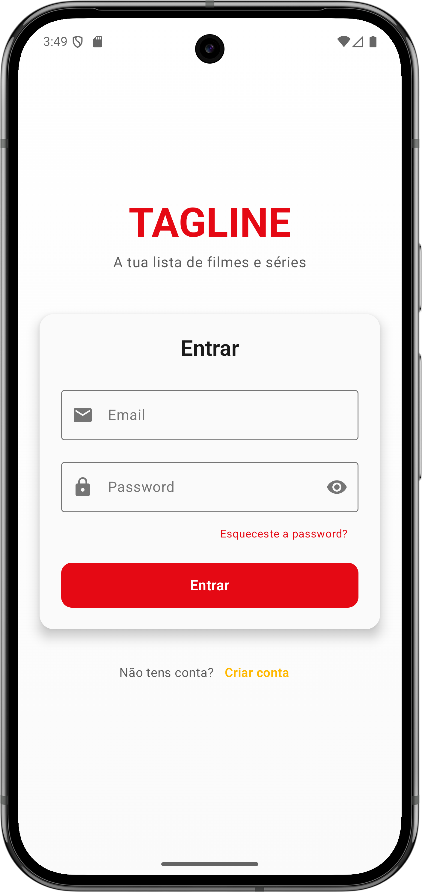
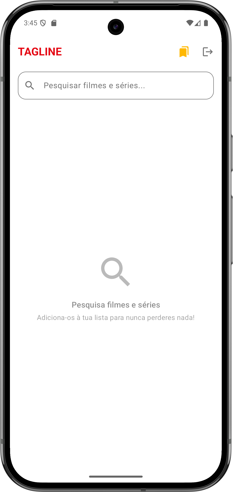
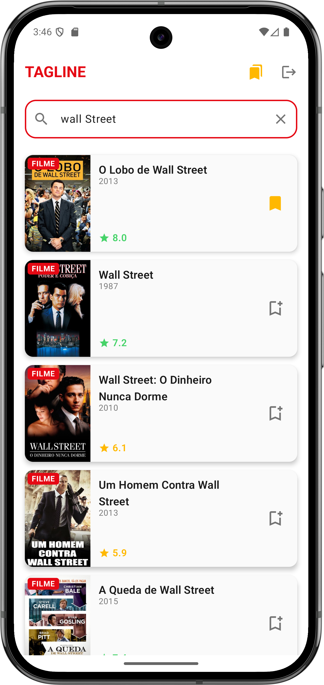
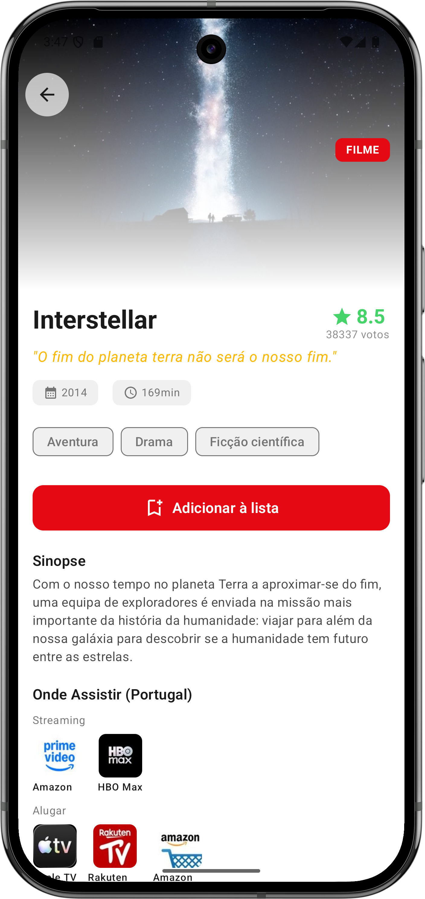
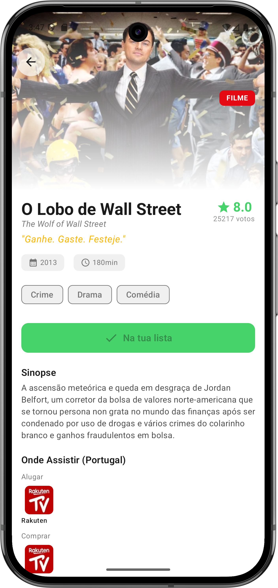
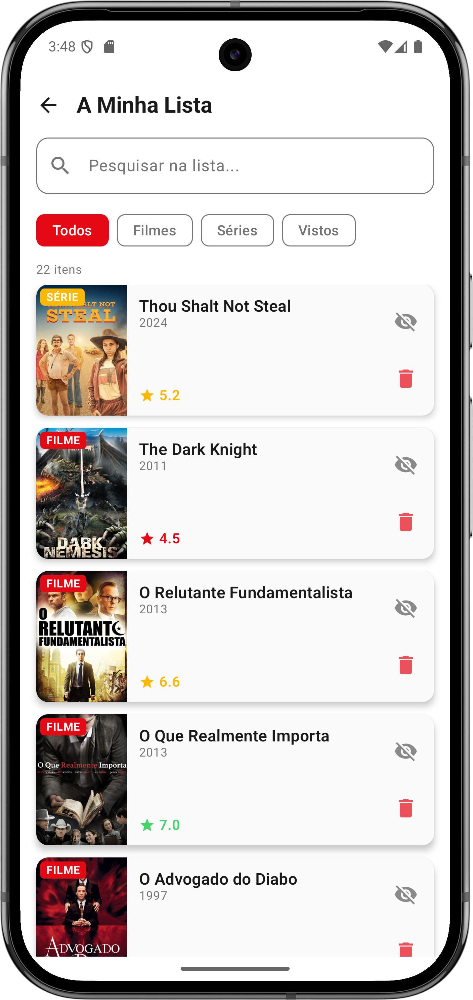
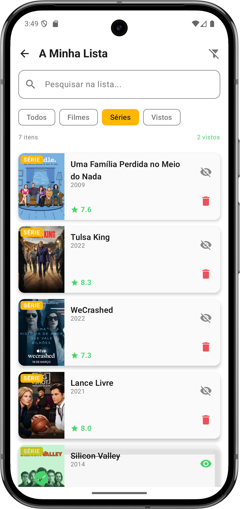
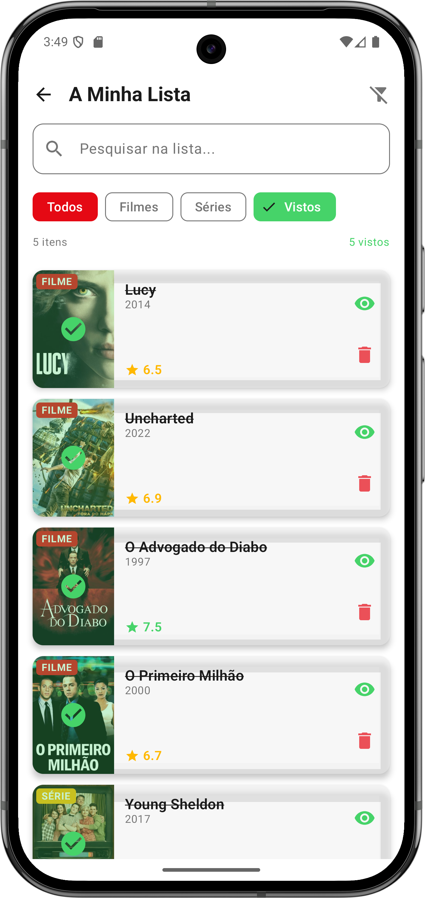

<p align="center">
  
</p>

<h1 align="center">Tagline</h1>

<p align="center">
  <strong>A tua lista de filmes e séries para nunca perderes nada!</strong>
</p>

<p align="center">
  
  
  
  
</p>

---

## Sobre

**Tagline** é uma aplicação Android para gerir a tua lista pessoal de filmes e séries que queres assistir. Pesquisa qualquer título, vê a classificação, descobre onde está disponível para streaming e guarda na tua lista para nunca mais esqueceres!

## Funcionalidades

- 🔐 **Autenticação** - Login, registo e recuperação de password com Firebase
- 🔍 **Pesquisa** - Encontra filmes e séries por título usando a API TMDB
- ⭐ **Classificações** - Vê a pontuação de cada título
- 📺 **Onde Assistir** - Descobre em que plataformas está disponível (Netflix, HBO, Disney+, etc.)
- 📋 **Minha Lista** - Guarda os títulos que queres ver
- 🎬 **Filtros** - Filtra por filmes, séries ou já vistos
- ✅ **Marcar como Visto** - Acompanha o teu progresso
- 🕐 **Histórico de Pesquisas** - Acede rapidamente às pesquisas recentes
- 💾 **Cache Local** - Carregamento mais rápido com Room Database

## Screenshots

<p align="center">
  
  
  
  
</p>

<p align="center">
  
  
  
  
</p>

## Tecnologias

| Tecnologia | Descrição |
|------------|-----------|
| **Kotlin** | Linguagem de programação |
| **Jetpack Compose** | UI toolkit moderno |
| **Clean Architecture + MVVM** | Arquitetura em camadas |
| **Hilt** | Dependency Injection |
| **Retrofit** | HTTP Client |
| **Room** | Base de dados local (cache) |
| **Coil** | Image Loading |
| **Firebase Auth** | Autenticação |
| **Firebase Firestore** | Base de dados cloud |
| **TMDB API** | Dados de filmes/séries |
| **Navigation Compose** | Navegação |
| **Kotlin Coroutines + Flow** | Programação assíncrona |

## Arquitetura

A aplicação segue a **Clean Architecture** combinada com **MVVM**, garantindo escalabilidade, testabilidade e separação de responsabilidades.

### Estrutura de Camadas

```
app/src/main/java/com/example/tagline/
│
├── domain/                          # 🎯 DOMAIN LAYER (Kotlin Puro)
│   ├── model/                       # Modelos de domínio
│   │   ├── Media.kt                 # Filme/Série
│   │   ├── MovieDetails.kt          # Detalhes de filme
│   │   ├── TvDetails.kt             # Detalhes de série
│   │   ├── Genre.kt                 # Género
│   │   ├── SavedMedia.kt            # Item guardado
│   │   ├── WatchProvider.kt         # Plataforma de streaming
│   │   ├── SearchResult.kt          # Resultado de pesquisa
│   │   └── AuthResult.kt            # Resultado de autenticação
│   │
│   ├── repository/                  # Interfaces de repositório
│   │   ├── AuthRepository.kt
│   │   ├── MediaRepository.kt
│   │   ├── SavedMediaRepository.kt
│   │   └── SearchHistoryRepository.kt
│   │
│   └── usecase/                     # Casos de uso (lógica de negócio)
│       ├── SearchMediaUseCase.kt
│       ├── GetMovieDetailsUseCase.kt
│       ├── GetTvDetailsUseCase.kt
│       ├── GetWatchProvidersUseCase.kt
│       ├── LoginUseCase.kt
│       ├── RegisterUseCase.kt
│       ├── SendPasswordResetUseCase.kt
│       ├── AddToListUseCase.kt
│       ├── GetSavedItemsUseCase.kt
│       ├── RemoveFromListUseCase.kt
│       ├── ToggleWatchedUseCase.kt
│       ├── CheckItemSavedUseCase.kt
│       ├── GetAllGenresUseCase.kt
│       ├── GetSearchHistoryUseCase.kt
│       └── DeleteSearchHistoryUseCase.kt
│
├── data/                            # 📦 DATA LAYER
│   ├── remote/
│   │   ├── api/                     # Serviços de API
│   │   │   └── TmdbApiService.kt
│   │   └── dto/                     # Data Transfer Objects
│   │       ├── TmdbDtos.kt          # DTOs + Mappers
│   │       └── SavedItemMapper.kt   # Entity + Mappers
│   │
│   ├── local/                       # Room Database
│   │   ├── AppDatabase.kt
│   │   ├── dao/                     # Data Access Objects
│   │   └── entity/                  # Entidades da BD
│   │
│   └── repository/                  # Implementações de repositório
│       ├── AuthRepositoryImpl.kt
│       ├── MediaRepositoryImpl.kt
│       ├── SavedMediaRepositoryImpl.kt
│       └── SearchHistoryRepositoryImpl.kt
│
├── di/                              # 💉 DEPENDENCY INJECTION
│   ├── NetworkModule.kt             # Retrofit, OkHttp
│   ├── DatabaseModule.kt            # Room
│   ├── FirebaseModule.kt            # Firebase
│   └── RepositoryModule.kt          # Binds Interface → Impl
│
├── ui/                              # 🎨 PRESENTATION LAYER
│   ├── navigation/                  # Navegação
│   │   ├── NavRoutes.kt
│   │   └── TaglineNavHost.kt
│   │
│   ├── screens/
│   │   ├── auth/
│   │   │   ├── AuthViewModel.kt
│   │   │   ├── LoginScreen.kt
│   │   │   ├── RegisterScreen.kt
│   │   │   └── ForgotPasswordScreen.kt
│   │   ├── search/
│   │   │   ├── SearchViewModel.kt
│   │   │   └── SearchScreen.kt
│   │   ├── details/
│   │   │   ├── DetailsViewModel.kt
│   │   │   └── MovieDetailsScreen.kt
│   │   └── mylist/
│   │       ├── MyListViewModel.kt
│   │       └── MyListScreen.kt
│   │
│   └── theme/                       # Material Design 3
│       ├── Color.kt
│       ├── Theme.kt
│       └── Type.kt
│
└── util/                            # 🛠️ UTILITIES
    ├── Constants.kt
    └── Resource.kt                  # Wrapper para estados
```

### Princípios Aplicados

#### 1. Separação de Camadas

| Camada | Responsabilidade | Dependências |
|--------|------------------|--------------|
| **Domain** | Lógica de negócio pura | Nenhuma (Kotlin puro) |
| **Data** | Acesso a dados | Domain |
| **Presentation** | UI e estado | Domain |

#### 2. Use Cases

Cada operação de negócio é encapsulada num Use Case com:
- Operador `invoke()` para chamada como função
- Retorno `Flow<Resource<T>>` para operações assíncronas
- Tratamento específico de `HttpException` e `IOException`

```kotlin
class SearchMediaUseCase @Inject constructor(
    private val mediaRepository: MediaRepository
) {
    operator fun invoke(query: String): Flow<Resource<SearchResult>> = flow {
        emit(Resource.Loading())
        try {
            val result = mediaRepository.searchMulti(query)
            emit(Resource.Success(result))
        } catch (e: HttpException) {
            emit(Resource.Error("Erro de servidor: ${e.code()}"))
        } catch (e: IOException) {
            emit(Resource.Error("Verifique a sua ligação à internet"))
        }
    }
}
```

#### 3. DTOs vs Domain Models

- **DTOs**: Contêm anotações `@SerializedName`, nunca saem da camada Data
- **Domain Models**: Kotlin puro, usados em toda a aplicação
- **Mappers**: Funções de extensão para conversão (ex: `dto.toMovieDetails()`)

#### 4. Repository Pattern

- **Interfaces** definidas no Domain
- **Implementações** no Data
- DI com `@Binds` para desacoplamento

#### 5. State Management

```kotlin
// Estado imutável
data class SearchUiState(
    val isLoading: Boolean = false,
    val results: List<Media> = emptyList(),
    val errorMessage: String? = null
)

// ViewModel processa Flows com .onEach
searchMediaUseCase(query)
    .onEach { result ->
        _uiState.value = when (result) {
            is Resource.Loading -> _uiState.value.copy(isLoading = true)
            is Resource.Success -> _uiState.value.copy(results = result.data)
            is Resource.Error -> _uiState.value.copy(errorMessage = result.message)
        }
    }
    .launchIn(viewModelScope)
```

### Fluxo de Dados

```
┌─────────────┐     ┌──────────────┐     ┌────────────┐     ┌──────────────┐
│   Screen    │────▶│  ViewModel   │────▶│  Use Case  │────▶│  Repository  │
│ (Composable)│◀────│  (StateFlow) │◀────│  (Flow)    │◀────│  (Interface) │
└─────────────┘     └──────────────┘     └────────────┘     └──────────────┘
                                                                    │
                                                                    ▼
                                                            ┌──────────────┐
                                                            │  Repository  │
                                                            │   (Impl)     │
                                                            └──────────────┘
                                                               │       │
                                                    ┌──────────┘       └──────────┐
                                                    ▼                              ▼
                                            ┌──────────────┐              ┌──────────────┐
                                            │   Remote     │              │    Local     │
                                            │ (Retrofit)   │              │   (Room)     │
                                            └──────────────┘              └──────────────┘
```

### Cache Local (Room)

| Tabela | Descrição | Validade |
|--------|-----------|----------|
| `genres` | Lista de géneros | Permanente |
| `cached_media` | Detalhes de filmes/séries | 24 horas |
| `search_history` | Histórico de pesquisas | Últimas 20 |

**Benefícios:**
- Carregamento mais rápido dos detalhes já visitados
- Histórico de pesquisas para acesso rápido
- Menos chamadas à API (economia de dados)

## Configuração

### Pré-requisitos

- Android Studio Hedgehog ou superior
- **JDK 17** (JDK 25+ não é suportado pelo Gradle)
- Conta Firebase
- API Key TMDB

### Instalação

1. Clona o repositório
```bash
git clone https://github.com/ricardoguimaraes2021/tagline.git
```

2. Configura o Firebase
   - Cria um projeto no [Firebase Console](https://console.firebase.google.com/)
   - Adiciona uma app Android com package `com.example.tagline`
   - Faz download do `google-services.json` para `app/`
   - Ativa Authentication (Email/Password) e Firestore

3. Configura as API Keys em `local.properties`
```properties
TMDB_API_KEY=a_tua_api_key
WATCHMODE_API_KEY=a_tua_api_key
```

4. Compila e executa no Android Studio

## Autor

**Ricardo Guimarães** - Projeto Final

## Licença

Este projeto foi desenvolvido para fins académicos.
